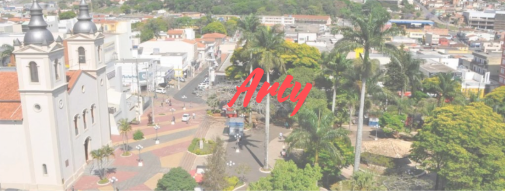

### Curso Técnico de Desenvolvimento de Sistemas - Senai Itapeva
# Arty

**Descrição:**
O projeto se consiste em um site de eventos culturais chamado de "Arty", possuindo o objetivo de mostrar eventos culturais na cidade aonde o usúario se localiza.
## Índice
- Visual Studio Code
- Feito por: Heitor de Santana Schutz
- Licença
## Funcionalidades
 - Procurar eventos locais e compra de ingressos
 - Cadastrar os própios eventos e editar.
 - Acesso rapido para informações e de facil acesso e manuseio
## Tecnologias Utilizadas
- **Linguagem/Frameworks:**
 - JavaScript
 - HTML
 - CSS
 - Bootstrap
## Autores
Mencione o nome dos alunos responsáveis pelo desenvolvimento do projeto e seus respectivos contatos.
- Heitor de Santana Schutz - https://github.com/funnyhdss - heitor.schutz.senaisp@gmail.com
- Pedro Eduardo Roel - https://github.com/pedroeroel - pedroedroel@gmail.com
- Antonio Jairo Alves Cordeiro Neto - https://github.com/AJACN - antonio.jairo.senai@gmail.com
## Licença
Este projeto está licenciado sob a Licença MIT - veja o arquivo LICENSE para mais detalhes.